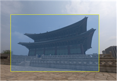
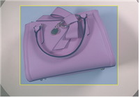

# **한국형 사물 이미지 AI데이터**

* 국내 장소, 객체에 대한 인공지능 인식기술 개발 및 성능강화를 위해 한국형 사물이미지인 국가지정문화재, 국내 상품, 도시별 랜드마크 이미지 AI 데이터 개방

# **한국형 사물 이미지 AI데이터**
* 인공지능 사물 이미지 인식기술은 자율주행,스마트시티,스마트제조,무인스토어 등 다양한    산업분야에서 활용 가능한 기술임
* 구글, 이미지넷, MS COCO 등 대용량 이미지 공개 사이트에는 국내 특성에 맞는 AI학습    데이터 부족함
* 국내 장소, 객체에 대한 인공지능기반의 시각지능 기술 개발 및 서비스 강화를 위해 
  한국형 사물이미지 AI 데이터 공개 필요
  
# 구축내용
* 촬영(수집)데이터 : 한국형 이미지 360만장
* 국가지정 유적건조물(탑, 성곽, 가옥, 궁궐, 사찰 등) 260만면, 상품(신발,가방,지갑,잡화 등) 80만면, 30개 도시 랜드마크 20만면
* 데이터 촬영 및 이미지 수집을 통한 데이터 구축

# 데이터 구조

| No | No      | No         | 항목명                    | 설명                | 필수여부 |
|----|---------|------------|------------------------|-------------------|------|
| 1  |         |            | image                  | 이미지 정보            | Y    |
|    | 01월 01일 |            | identifier             | 파일명               | Y    |
|    | 01월 02일 |            | imsize                 | 이미지 파일 크기         | Y    |
| 2  |         |            | regions                | 관련정보              | Y    |
|    | 02월 01일 |            | type                   | 어노테이션 종류          | Y    |
|    | 02월 02일 |            | boxcorners             | 어노테이션좌표값 (좌측X,Y좌표/우측X,Y좌표)          | Y    |
|    | 02월 03일 |            | ansize                 | 이미지 영역 사이즈        | Y    |
|    | 02월 04일 |            | class                  | 클래스명              | Y    |
|    | 02월 05일 |            | tags                   | 분류 항목             | Y    |
|    |         | 2002-05-01 | 종ID                    | 종 아이디 정보          | Y    |
|    |         | 2002-05-02 | 대분류                    | 대분류 정보            | Y    |
|    |         | 2002-05-03 | 중분류                    | 중분류 정보            | Y    |
|    |         | 2002-05-04 | 소분류                    | 소분류 정보            |      |
|    |         | 2002-05-05 | Instance               | 대상체               | Y    |
|    |         | 2002-05-06 | Instance Upper         | 대상체 상위 레벨         |      |
|    |         | 2002-05-07 | GPS 위도                 | GPS 위도 값          |      |
|    |         | 2002-05-08 | GPS 경도                 | GPS 경도 값          |      |
|    | 02월 06일 |            | instance_uri           | 온톨리지 uri 정보       |      |
|    | 02월 07일 |            | sem_ext                | 의미확장 정보           | Y    |
|    |         | 2002-07-01 | property : locatedIn   | 의미확장 지역정보         | Y    |
|    |         | 2002-07-02 | property : relatedTerm | 의미확장 연관정보         | Y    |
|    |         | 2002-07-03 | property : description | 의미확장 상세정보         | Y    |

  

## Data Description(데이터셋 )

| 대분류    | 중분류   | 소분류      | 대상체명                    |
|--------|-------|----------|-------------------------|
| 유적 건조물 | 과학기술  | 천문지리시설   | 서울관상감관천대                |
| 유적 건조물 | 교육문화  | 교육시설     | 배재학당동관,연세대학교스팀슨관        |
| 유적 건조물 | 교통통신  | 교통.통신시설  | 서울우정총국,창경궁옥천교,봉천대       |
| 유적 건조물 | 무덤    | 무덤       | 화의군이영묘역,여계묘역,방이동고분군     |
| 유적 건조물 | 무덤    | 봉토묘      | 류순정·류홍부자묘역,이규보묘,정제두묘    |
| 유적 건조물 | 무덤    | 왕실무덤     | 영산군이전묘역,양녕대군이제묘역,서울정릉   |
| 유적 건조물 | 불교공예  | 의식법구     | 선덕대왕신종                  |
| 유적 건조물 | 불교조각  | 금속조      | 백률사금동약사여래입상             |
| 유적 건조물 | 불교조각  | 석조       | 영지석불좌상,백운대마애불입상,보리사마애석불 |
| 유적 건조물 | 산업생산  | 산업시설     | 구용산수위관측소,광통관,구세군중앙회관    |
| 유적 건조물 | 산업생산  | 요업시설     | 조선백자요지,남현동요지,동방동와요지     |
| 유적 건조물 | 서각류   | 금석각류     | 중성리신라비,이씨삼강묘비,손종로정충비각   |
| 유적 건조물 | 인물사건  | 역사사건시설   | 아담스기념관,사육신묘,삼전도비        |
| 유적 건조물 | 인물사건  | 인물기념시설   | 안창호묘소,최규하가옥,홍파동홍난파가옥    |
| 유적 건조물 | 일반조각  | 암벽조각     | 석장동암각화,안심리암각화           |
| 유적 건조물 | 정치국방  | 궁궐·관아    | 창경궁근정전,경복궁수정전,창덕궁       |
| 유적 건조물 | 정치국방  | 근대정치국방   | 구서대문형무소,구러시아공사관,구벨기에영사관 |
| 유적 건조물 | 정치국방  | 성        | 흥인지문,숭례문,몽촌토성           |
| 유적 건조물 | 정치국방  | 전쟁관련시설   | 포천방어벙커,영국군설마리전투비        |
| 유적 건조물 | 종교신앙  | 제사유적     | 선농단,서빙고동부군당,강화참성단       |
| 유적 건조물 | 종교신앙  | 종교시설     | 흥천사극락보전,봉은사선불당,약현성당     |
| 유적 건조물 | 종교신앙  | 탑        | 거동사지원공국사탑,봉림사지진경대사탑     |
| 유적 건조물 | 주거생활  | 조경건축     | 탑골공원팔각정,봉황각,용양봉저정       |
| 유적 건조물 | 주거생활  | 주거건축     | 도정궁경원당,김좌근고택,월계동각심재     |
| 유적 건조물 | 기타    | 공용시설     | 청량리역검수차고,한강철도교          |
| 유적 건조물 | 기타    | 기타 시설물   | 방화수류정,수광리오름가마           |
| 유적 건조물 | 기타    | 문화집회시설   | 건국대학교구서북학회회관,창경궁대온실     |
| 유적 건조물 | 기타    | 상업시설     | 구부국원,선린동공화춘,구대화조사무소     |
| 유적 건조물 | 기타    | 업무시설     | 수원문화원,기상관측소.구미국문화원      |
| 유적 건조물 | 기타    | 의료시설     | 구용산철도병원본관,대한의원          |
| 상품     | 귀금속   | 귀걸이      | 골드귀걸이,실버귀걸이,피어싱         |
| 상품     | 귀금속   | 반지       | 패션반지,골드반지,실버반지          |
| 상품     | 귀금속   | 목걸이/팬던트  | 패션목걸이,골드목걸이,실버목걸이       |
| 상품     | 화장품   | 스킨케어     | 수분크림,아이크림,앰플            |
| 상품     | 화장품   | 선케어/메이크업 | 파운데이션,컨실러,립글로즈          |
| 상품     | 화장품   | 클렌징/마스크팩 | 클랜징폼,마스크팩,코팩            |
| 상품     | 화장품   | 향수       | 여성향수,남성향수,미니어쳐          |
| 상품     | 화장품   | 남성화장품    | 남성선케어,남성스킨,에프터쉐이브       |
| 상품     | 시계    | 패션시계     | 가죽시계,메탈시계,팔찌시계          |
| 상품     | 시계    | 기타 시계    | 목걸이시계,전자시계,탁상시계         |
| 상품     | 신발    | 운동화/캐주얼화 | 패션운동화,하이탑,키높이운동화        |
| 상품     | 신발    | 여성화      | 플랫슈즈,슬리퍼샌들,앵클부츠         |
| 상품     | 신발    | 남성화      | 남성구두,로퍼,캐주얼화            |
| 상품     | 신발    | 슬리퍼/기능화  | 일반슬리퍼,털슬리퍼,고무신          |
| 상품     | 신발    | 아동신발     | 아쿠아슈즈,발광운동화,롤러운동화       |
| 상품     | 가방    | 캐쥬얼가방    | 백팩,숄더백,크로스백             |
| 상품     | 가방    | 여성가방     | 클러치백,토트백,퀼팅백            |
| 상품     | 가방    | 남성가방     | 서류가방,맨스백,노트북가방          |
| 상품     | 가방    | 여행용가방    | 보스톤백,여행용백팩              |
| 상품     | 가방    | 운동용가방    | 수영쇼퍼백,테니스라켓가방           |
| 상품     | 가방    | 아동가방     | 캐릭터책가방,손가방,미아방지가방       |
| 상품     | 지갑    | 여성지갑     | 장지갑,중지갑,반지갑             |
| 상품     | 지갑    | 남성지갑     | 장지갑,반지갑                 |
| 상품     | 지갑    | 기타지갑     | 카드지갑,명함지갑,동전지갑          |
| 상품     | 모자    | 패션모자     | 스냅백,야구모자,군모             |
| 상품     | 모자    | 아동모자     | 아동비니,썬캡,귀달이모자           |
| 상품     | 아이웨어  | 선글라스     | 여성선글라스,남성선글라스           |
| 상품     | 아이웨어  | 안경테      | 뿔테,금속테,무테               |
| 랜드마크   | 강릉시   | 동상/빌딩    | 오죽헌율곡이이동상,경포대스카이베이호텔    |
| 랜드마크   | 경주시   | 타워       | 경주타워                    |
| 랜드마크   | 공주시   | 정자/탑     | 공산선공산정,곰나루국민관광지웅비탐      |
| 랜드마크   | 과천시   | 센터       | 국립과천과학관                 |
| 랜드마크   | 광양시   | 빌딩       | 이편한세상                   |
| 랜드마크   | 광주광역시 | 탑/빌딩     | 518민주묘지상징탑,KDB생명빌딩      |
| 랜드마크   | 구리시   | 타워/동상    | 구리타워,광개토대왕동상            |
| 랜드마크   | 군산시   | 센터       | 근대역사박물관                 |
| 랜드마크   | 나주시   | 빌딩       | 한국전력공사 본사               |
| 랜드마크   | 대구시   | 타워/빌딩    | 83타워                    |
| 랜드마크   | 대전시   | 탑/타워     | 수성SK리더스뷰                |
| 랜드마크   | 목포시   | 센터       | 김대중노벨평화상기념관             |
| 랜드마크   | 부산시   | 타워/다리/빌딩 | 용두산부산타워                 |
| 랜드마크   | 서울시   | 빌딩/동상/타워 | 63빌딩,이순신장군상,서울남산타워      |
| 랜드마크   | 성남시   | 전망대      | 율동공원번지점프                |
| 랜드마크   | 세종시   | 센터       | 정부세종컨벤션센터               |
| 랜드마크   | 속초시   | 타워       | 엑스포타워                   |
| 랜드마크   | 수원시   | 전망대      | 광교프라이부르크전망대             |
| 랜드마크   | 안동시   | 동상/다리    | 월영교                     |
| 랜드마크   | 안성시   | 동상       | 바우덕이사당조각상               |
| 랜드마크   | 양산시   | 타워       | 양산타워                    |
| 랜드마크   | 여수시   | 타워/등대    | 하멜등대,여수엑스포역스카이타워전망대     |
| 랜드마크   | 용인시   | 타워/센터    | 아프리아타워,백남준아트센터          |
| 랜드마크   | 울산시   | 전망대/센터   | 울산대교전망대,이안태화강엑소디움       |
| 랜드마크   | 인천시   | 다리/타워    | 인천대교,송대G타워,경인운하아라타워     |
| 랜드마크   | 전주시   | 성문/타워    | 풍남문,코오롱스카이타워            |
| 랜드마크   | 제주시   | 봉우리/빌딩   | 성산일출봉,롯데시티호텔제주          |
| 랜드마크   | 진주시   | 전망대      | 촉석루                     |
| 랜드마크   | 창원시   | 천/다리/빌딩  | 저도연륙교,여좌천               |
| 랜드마크   | 천안시   | 탑/빌딩     | 독립기념관겨레의탑,펜타포트          |
| 랜드마크   | 청주시   | 동상/빌딩    | 용두사지철당간,초정약수동상          |
| 랜드마크   | 춘천시   | 동상/다리/빌딩 | 소양강처녀상,공지천구름다리          |
| 랜드마크   | 파주시   | 동상       | 임진각평화누리공원통일바라기조각상       |
| 랜드마크   | 포항시   | 등대/빌딩    | 호미곶등대,장성두산위브더제니스        |
| 랜드마크   | 화성시   | 빌딩       | 메타폴리스                   |

## Data Description(데이터셋 )
#### 산업분야
* 국내 인공지능 사물 인식 카메라 성능 향상과 인식된 사물에 대한 연관정보 제공
* 외국인 관광객 대상 관광 안내 및 청소년 현장 교육에 AI서비스 제공
연구분야
* 국내 중소･벤처, 스타트업 등 AI 관련 기업들의 데이터 활용성 증대
